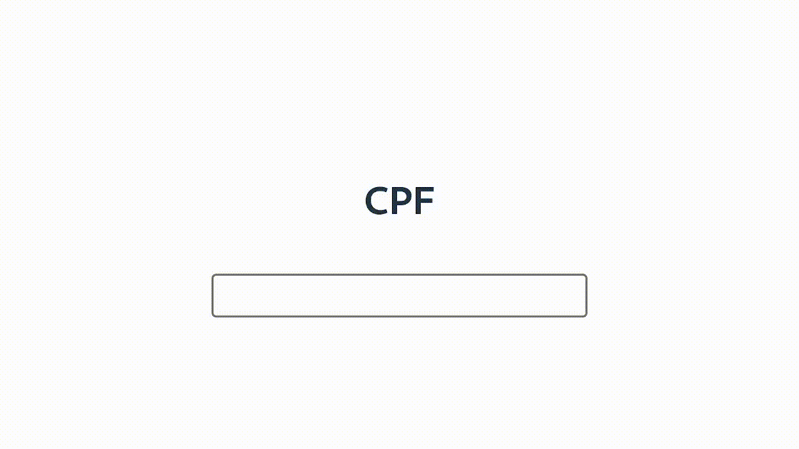

# Biblioteca de Máscaras

Uma biblioteca JavaScript/TypeScript que fornece máscaras de formatação para diversos formatos.



## Máscaras suportadas
- CPF
- Números
- Real
- Data
- CNPJ
- CEP
- Telefone

## Instalação

Instale a biblioteca utilizando o npm:

```bash
npm install biblioteca-mascaras@latest
```

# Como usar

Importe a biblioteca e utilize as funções de máscaras disponíveis:

```javascript
import mascaras from 'biblioteca-mascaras'

console.log(mascaras.maskNumber('1000'))
// output: 1k

console.log(mascaras.maskDate('01012023'))
// output: 01/01/2023

console.log(mascaras.maskCnpj('000000000000000'))
// output: 00.000.000/0000-00

console.log(mascaras.maskPhone('55111111111'))
// output: (55) 11111-1111

console.log(mascaras.maskCep('00000000'))
// output: 00000-000

console.log(mascaras.maskCurrency('33'))
// output: R$ 33,00

console.log(mascaras.maskCpf('00000000000'))
// output: 000.000.000-00
```
