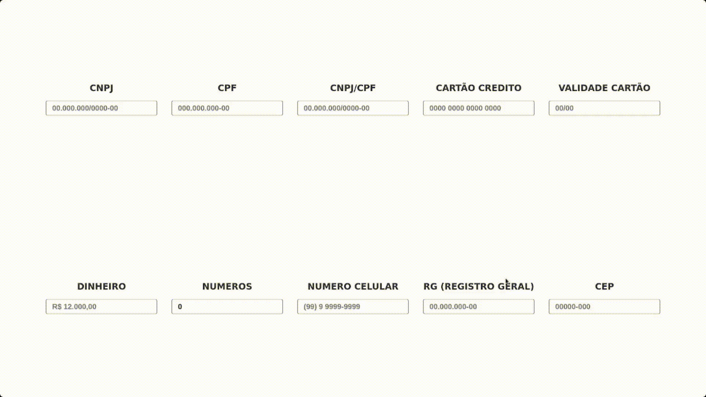

# Biblioteca de Máscaras

Uma biblioteca JavaScript/TypeScript que fornece máscaras de formatação para diversos formatos.



# Demo

- <a href="https://lucas-marquisio.github.io/lib-masks/" style="color: #00ff; text-decoration: underline;"> 
  Testar Mascaras
</a>

- <a href="https://github.com/lucas-marquisio/lib-masks" style="color: #00ff; text-decoration: underline;">Github</a>

## Máscaras suportadas
- CPF
- Números 
- Moeda R$
- CEP
- CNPJ
- Telefone/Celular
- CPFCNPJ (automatico)
- RG
- Cartão de credito & Data de validade

## Instalação

Instale a biblioteca utilizando o npm:

```bash
npm install biblioteca-mascaras@latest
```

# Como usar

Importe a biblioteca e utilize as funções de máscaras disponíveis:

```javascript
import mask from 'biblioteca-mascaras'

mask.Cpf('00000000000')
// output: 000.000.000-00

mask.Money('1')
// output: R$ 0,01

mask.CNPJ('000000000000000')
// output: 00.000.000/0000-00

mask.Phone('55111111111')
// output: (55) 1 1111-1111

mask.Cep('00000000')
// output: 00000-000

mask.RG('3333333333')
// output: 33.333.333-33

mask.Numbers('100000')
// output: 100.000

mask.CpfCNPJ('00000000000')
// output: detect if cpf or cnpj

mask.CreditCardNumber('0000000000000000')
// output: 0000 0000 0000 0000

mask.CreditCardDate('100000')
// output: 00/00
```